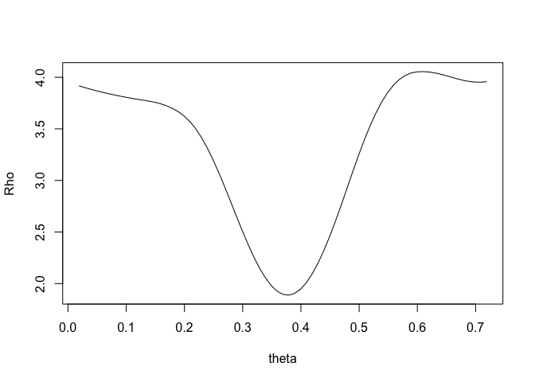

# robustDIF
Peter F Halpin
2026-02-26

# robustDIF

An R package that provides functions for assessing differential item
functioning (DIF) in item response theory (IRT) models using methods
from robust statistics. Based on the paper:

Halpin, P.F. (2022) Differential Item Functioning Via Robust Scaling.
arXiv preprint. <https://arxiv.org/abs/2207.04598>. Published in
Psychometrika in 2024 under the same title.

Recent additions:

- Support for graded response model
- Read functions for `mirt` and `lavaan`
- Test whether naive estimates of impact are affected by DIF
  (`delta_test`)

Under development:

- S3 rdif class with supporting methods
- Multi-parameter tests of DIF / measurement invariance
- Additional models and multiple groups

Technical notes:

- HTML:
  <https://htmlpreview.github.io/?https://github.com/peterhalpin/robustDIF/blob/master/technical-notes.html>
- Source file: [technical-notes.qmd](technical-notes.qmd)

# Installation

``` r
install.packages("remotes")
remotes::install_github("peterhalpin/robustDIF")
library(robustDIF)
```

# Illustration

## Example Dataset

The main user-facing functions are illustrated below using the built-in
example dataset `rdif.eg`. In the example dataset, there are a total of
five binary items and the first item has DIF on the intercept
(threshold) equal to 1/2 SD on the latent trait. The latent trait was
generated from *N*(0,1) in the reference group and *N*(.5, 1) in the
comparison group.

Check out the documentation for `rdif.eg` and `get_model_parms` for more
info about formatting model output for use with `robustDIF`.

## Scaling Functions

The RDIF procedure is a robust version of moment-based scaling in IRT
(see, e.g., Kolen, M. J., & Brennan, R. L. (2014). Test Equating,
Scaling, and Linking. Springer.
https://doi.org/10.1007/978-1-4939-0317-7, Chap. 6). Robustness is
achieved by downweighting items that exhibit DIF, which amounts to
flagging items for DIF during estimation of the scaling parameter.
Following estimation of the scaling parameter, Wald tests of DIF can be
implemented.

<!--The target scaling parameter is defined in terms of the parameters of the distribution of the latent trait. If an item does not exhibit DIF, the target scaling parameter can be written as a function of the parameters the item. The latter are refered to as item-level scaling functions. Usual approaches to moment-based scaling estimate the target scaling parameter by taking an unweighted average of item-level scaling functions evaluated at the maximum likelihood estimates of the item parameters. 
&#10;In `robustDIF`, robustness is achieved by down-weighting items that exhibit DIF when estimating the scaling parameter. This achieved using iteratively reweighted least squares (IRLS) with Tukey's bisquare. The tuning parameter of the bisquare is set via the desired false positive rate for flagging items with DIF (denoted `alpha`). Following estimation of the scaling parameter, Wald tests of DIF can be implemented. -->

The type of DIF that is tested depends on the choice of scaling
parameter. Let $\theta_g \thicksim N(\mu_g, \sigma_g)$ and $a_{ig}$ and
$d_{ig}$ denote the item slope and intercept/thresholds respectively.
The choices of scaling parameters and corresponding item-level scaling
functions are as follows.

| Name | Scaling parameter | Item-level scaling function | Test for DIF on |
|----|----|----|----|
| `a_fun1` | $\sigma_2 / \sigma_1$ | $a_{2i} / a_{1i}$ | slope |
| `a_fun2` | $\log(\sigma_2 / \sigma_1)$ | $\log(a_{2i} / a_{1i})$ | slope |
| `d_fun1` | $(\mu_2 - \mu_1) / \sigma_1$ | $(d_{2i} - d_{1i}) / a_{1i}$ | intercept |
| `d_fun2` | $(\mu_2 - \mu_1) / \sigma_2$ | $(d_{2i} - d_{1i}) / a_{2i}$ | intercept |
| `d_fun3` | $(\mu_2 - \mu_1) / \sqrt{(\sigma_1^2 + \sigma_2^2)/2}$ | $(d_{2i} - d_{1i}) / \sqrt{(a_{1i}^2 + a_{2i}^2)/2}$ | slope + intercept |

The illustration uses `d_fun3`. This function is more sensitive to
intercept-DIF than slope-DIF.

## Robust Scaling

The scaling parameter can be estimated using `rdif`. Estimation uses
iteratively reweighted least squares with Tukey’s bisquare. The tuning
parameter of the bisquare is set via the desired false positive rate for
flagging items with DIF (`alpha`). See the technical notes for details.

``` r
mod <- rdif(mle = rdif.eg, fun = "d_fun3", alpha = .05)
summary(mod)
```

    Robust Scaling and Differential Item Functioning.

    Data: 5 items 
    Estimation ended after  6  iterations
    Single solution found

    Est: 0.376    SE: 0.0928 

    Results from Wald Tests of DIF:
                    delta         se      z.test        p.val
    item1_d1  0.351129635 0.09867331  3.55850682 0.0003729691
    item2_d1  0.006566087 0.06654194  0.09867593 0.9213955818
    item3_d1  0.017345461 0.10887831  0.15931052 0.8734242308
    item4_d1 -0.006742385 0.20492283 -0.03290207 0.9737526822
    item5_d1 -0.357290253 0.24134142 -1.48043486 0.1387572332

The estimated scaling parameter is approximately `0.38` (SE = `0.09`).
The data generating value was `0.50`.

The Wald tests indicate that they first item was flagged for DIF at the
5% level. This item was downweighted to zero during estimation of the
scaling parameter (based on `alpha = .05`).

Note that in this output, `delta` is the estimated scaling parameter
subtracted from the value of item-level scaling function.

## Testing Whether DIF Affects Conclusions about Impact

One may wish to know whether any DIF, if present, affects conclusions
about impact (i.e., how the groups differ on the latent trait). One way
to approach this question is to compare a naive estimate of impact that
ignores DIF to an estimator that is robust to DIF. In `robustDIF`, the
naive estimator is chosen to be the unweighted mean of the item-level
scaling functions (i.e., the usual IRT moment-based scaling estimator).
The robust estimator is as above. The null hypothesis that both
estimators are consistent for the “true” scaling parameter leads to the
following test.

``` r
delta_test(mod)
```

      naive.est   naive.se  rdif.est    rdif.se       delta   delta.se    z.test
    1 0.3783724 0.09673559 0.3761707 0.09282802 0.002201709 0.06256331 0.0351917
          p.val
    1 0.9719269

In this output, `delta` = `naive.est` - `rdif.est`

## The Rho Function

For data analyses, it is useful to check whether the robust estimator
has a clear global minimum before proceeding to make inferences about
DIF / Impact. The `plot` command produces the relevant diagnostic.

``` r
plot(mod)
```



Note the minimizing value of theta in the diagnostic plot corresponds to
the value reported above by `rdif`.
