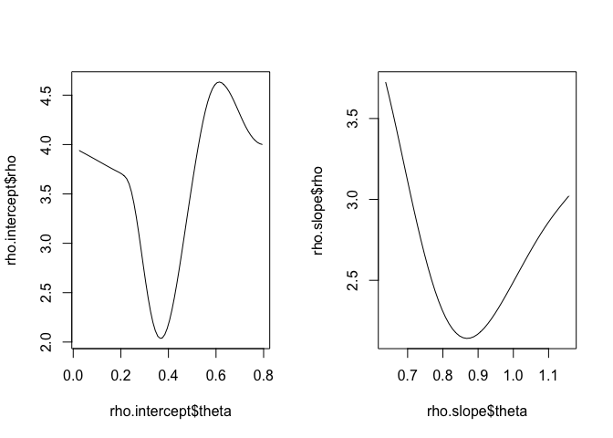

# robustDIF

An R package that provides functions for assessing differential item
functioning (DIF) in item response theory (IRT) models using methods
from robust statistics. Based on the paper: Halpin, P.F. (2022)
Differential Item Functioning Via Robust Scaling
(<https://arxiv.org/abs/2207.04598>).

Recently, `robustDIF` was updated to support the graded response model
(GRM) in addition to the (2PL) IRT model, in two independent groups. It
will also provide sensible results for unidimesional item factor
analysis with a probit link for the measurement model and WLS estimation
instead of maximum likelihood. The convenience function
`get_model_parms` was updated to read-in from both `mirt` and `lavaan`.
New functions were added to test whether DIF affects conclusions about
impact (aka differential test functioning; `delta_test`).

Ongoing developments focus on comparisons across more than 2 groups,
dealing with dependent groups (e.g., longitudinal invariance), and
omnibus tests of DIF that correspond to different “levels” of
measurement invariance.

# Installation

``` r
install.packages("remotes")
remotes::install_github("peterhalpin/robustDIF")
library(robustDIF)
```

    ## Loading required package: Matrix

# Example Dataset

The main user-facing functions are illustrated below using the built-in
example dataset `rdif.eg`. In the example dataset, there are a total of
five binary items and the first item has DIF on the intercept
(threshold) equal to 1/2 SD on the latent trait. The latent trait was
generated from *N*(0,1) in the reference group and *N*(.5, 1) in the
comparison group.

Check out the documentation for `rdif.eg` and `get_model_parms` for more
info about how to format data for use with `robustDIF`.

# The RDIF Procedure

The RDIF procedure is a robust version of “mean/mean” IRT-based scaling
(see Kolen & Brennan, 2014, chap. 6). It is implemented as a
post-estimation step following separate calibrations of a focal IRT
model in a reference group (*g = 0*) and a comparison group (*g = 1*).
The IRT scaling parameters are estimated using functions of the item
parameters, which are referred to as “item-level scaling functions”. The
estimator is constructed to down-weight the item-level scaling functions
when an item exhibits DIF.

In the paper, it was emphasized how the down-weighting procedure can be
tuned to flag items with DIF at the desired asymptotic Type I Error
(false positive) rate during estimation of the scaling parameter.
However, more flexibility is provided by comparing the item-level
scaling functions to the robust estimate in a follow-up step. This is
more flexible because one can construct multi-parameter different tests
of interest (for all item parameters, for all items).

Letting $\mu$ and $\sigma^2$ denote the mean and variance of the latent
trait in the comparison group, the scaling parameter used to test for
DIF on the item intercepts is $\theta = \mu/\sigma$ and the item-level
scaling functions are $Y_i = (d_{1} - d_{0})/ a_1$ where $a$ is the item
slope, $d$ is the item intercept, and subscripts denote groups. Note
that $\theta = Y_i$ when item $i$ does not exhibit DIF. The scaling
parameter used to test for DIF on the item slopes is $\theta = \sigma$
and the item-level scaling functions are $Y_i = a_1/ a_0$.

The `rdif` function estimates the IRT scaling parameters by applying a
robust estimator of location to the item-level scaling functions. In the
output below, the estimated values of the scaling parameters are
indicated by `est`. Items with DIF are indicated by `weights = 0`. The
other output describes the iteratively re-weighted least squares
estimation routine (number of iterations and the convergence criterion).

``` r
# Item intercepts
rdif(mle = rdif.eg, par = "intercept", alpha = .05)
```

    ## $est
    ## [1] 0.3681
    ## 
    ## $weights
    ## [1] 0.0000 0.9921 0.8586 0.9967 0.3257
    ## 
    ## $n.iter
    ## [1] 8
    ## 
    ## $epsilon
    ## [1] 4.522e-08

``` r
# Item slopes
rdif(mle = rdif.eg, par = "slope", alpha = .05)
```

    ## $est
    ## [1] 0.865
    ## 
    ## $weights
    ## [1] 0.9866 0.4103 0.9674 0.6158 0.3197
    ## 
    ## $n.iter
    ## [1] 26
    ## 
    ## $epsilon
    ## [1] 8.302e-08

We can see that the first item exhibits DIF on the intercept (i.e., it
has a weight of zero). The estimated scaling parameters are reasonable
approximations of the data-generating values. Standard errors are
available for the estimated scaling parameter but the main interest is
to use them for testing DIF

# “Stand-Alone” Wald Tests of DIF

Inferences about DIF can also be made by following-up `rdif` with
stand-alone Wald tests of the item parameters. To test each item
parameter separately, use the function `rdif_z_test`:

``` r
# Wald test of item intercepts
rdif_z_test(mle = rdif.eg, par = "intercept")
```

    ##             z.test    p.val
    ## Item_1.d1  3.27118 0.001071
    ## Item_2.d1 -0.12356 0.901666
    ## Item_3.d1  0.53105 0.595383
    ## Item_4.d1 -0.08023 0.936054
    ## Item_5.d1 -1.28425 0.199055

``` r
# Wald test of item slopes
rdif_z_test(mle = rdif.eg, par = "slope")
```

    ##            z.test  p.val
    ## Item_1.a1 -0.1606 0.8724
    ## Item_2.a1  1.1751 0.2400
    ## Item_3.a1 -0.2511 0.8017
    ## Item_4.a1  0.9093 0.3632
    ## Item_5.a1 -1.2920 0.1964

Alternatively, the user can test all parameters for each item together
using a Wald test whose degrees of freedom is equal the number of item
parameters. These item-level tests (rather parameter-level tests) are
not equivalent to the flagging procedure because they combine
information across parameter estimates from the same item.

``` r
# Wald test of both parameters
rdif_chisq_test(mle = rdif.eg)
```

    ##        chi.square df    p.val
    ## Item_1    10.8363  2 0.004435
    ## Item_2     1.8111  2 0.404329
    ## Item_3     0.3699  2 0.831134
    ## Item_4     1.7593  2 0.414932
    ## Item_5     4.0397  2 0.132673

In the example, the Wald tests lead to the same conclusions as the
flagging procedure.

# Does DIF Affect Impact?

One may wish to know whether any DIF, if present, affects conclusions
about impact (i.e., how the groups differ on the latent trait). This
question is related to the topic of differential test functioning (DTF),
which addresses the extent to which test scores are biased by DIF (e.g.,
Chalmers et al., 2016). One way to approach this question is to compare
a naive estimate of impact that ignores DIF to an estimator that is
robust to DIF. In `robustDIF`, the naive estimator is chosen to be the
MLE of the scaling parameter, computed from the item-level scaling
functions, which is a precision-weighted version of the standard
“mean-mean” approach. The robust estimator is as above (see Halpin,
2022, for details). The null hypothesis that both estimators are
consistent for the “true” scaling parameter leads to a test of DTF.

The `delta_test` function implements this test. Note that, unlike other
procedures for DTF, implementation of this test does not require an
initial item-by-item analysis to identify which items may exhibit DIF –
it allows the user to test for DTF *before* doing a DIF analysis.

``` r
# Comparing Naive and Robust estimates to evaluate DTF 
# on the means of the latent trait
delta_test(mle = rdif.eg, par = "intercept")
```

    ## rdif.est   ml.est    delta se.delta   z.test    p.val 
    ##  0.36815  0.42572 -0.05757  0.04536 -1.26934  0.20432

``` r
# For the variance of latent trait
delta_test(mle = rdif.eg, par = "slope")
```

    ## rdif.est   ml.est    delta se.delta   z.test    p.val 
    ##  0.86505  0.83196  0.03309  0.10955  0.30203  0.76263

In the example, it can be seen that large DIF on a single item’s
intercept did not lead to statistically different conclusions about
impact.

# The Rho function

For data analyses, it is useful to check whether the M-estimator of the
IRT scaling parameters has a clear global minimum before proceeding to
make inferences about DIF. In `robustDIF`, the minimization problem is
described by `rho_fun`.

``` r
# Rho function for item intercepts
rho.intercept <- rho_fun(mle = rdif.eg, par = "intercept", grid.width = .01)
par(mfrow = c(1,2))
plot(rho.intercept$theta, rho.intercept$rho, type = "l")

# Rho function for item slopes
rho.slope <- rho_fun(mle = rdif.eg, par = "slope", grid.width = .01)
plot(rho.slope$theta, rho.slope$rho, type = "l")
```

<!-- -->

Note the minimizing values of theta in the plots corresponds to the
values reported by `rdif` above.

# References

Chalmers, R. P., Counsell, A., & Flora, D. B. (2016). It might not make
a big DIF: Improved differential test functioning statistics that
account for sampling variability. Educational and Psychological
Measurement, 76(1), 114–140. <https://doi.org/10.1177/0013164415584576>

Halpin, P.F. (2022) Differential Item Functioning Via Robust Scaling.
<https://arxiv.org/abs/2207.04598>.

Kolen, M. J., & Brennan, R. L. (2014). Test Equating, Scaling, and
Linking. Springer. <https://doi.org/10.1007/978-1-4939-0317-7>
