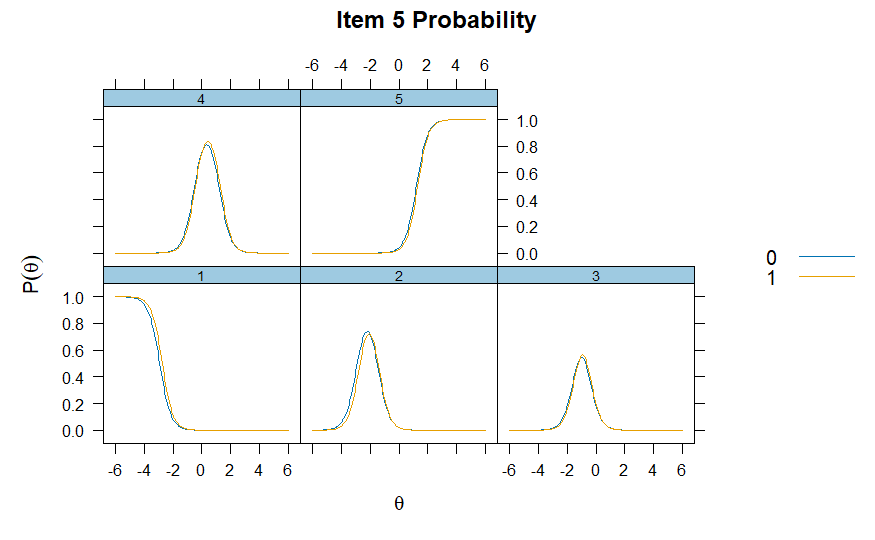
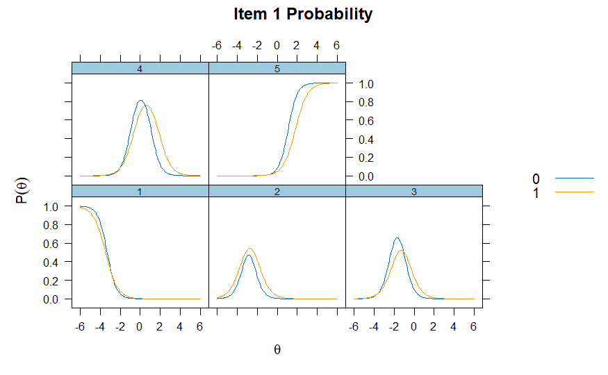

# Tests of robustDIF with item-level information

## Differential item functioning

In the Item Response Theory (IRT) literature, Differential Item
Functioning (DIF) is an approach to assessing situations where response
values to an assessment differ as a function of an external covariate;
for example, gender or treatment condition. In many contexts, the main
goal of DIF analysis is to evaluate whether the items on an assessment
are biased in regards to these external covariates. Traditional DIF
methods require analysts pre-specify a set of anchor items (items
assumed to not have DIF). In the robust DIF method, no such requirement
is made. (See technical notes for more details)

The following example demonstrates how to use `robustDIF` to investigate
DIF across gender in a 5-point Likert-type survey.

## Persistence in the Sciences Survey

The Persistence in the Sciences Survey is a validated self-report
instrument which measures several social and psychological factors
related to undergraduate students’ persistence in attaining STEM degrees
(Hanauer et al., 2016). The data used for this example consists of 1024
student responses to the Science Self-Efficacy portion of the survey.
These include seven items that ask students how confident they are in
performing scientific duties (e.g., “Please indicate the extent to which
you agree or disagree about your confidence in the following areas: I am
confident that I can use technical science skills.”) Response categories
are 1 = “Strongly Disagree”, 2 = “Disagree”, 3 = “Neither Agree nor
Disagree”, 4 = “Agree” and 5 = “Strongly Agree.” Administrative data
also included self-reported sex, 0 = “Male” and 1 = “Female.”

## Calculating multiple group Graded Response Model

The following code utilizes `mirt` to build graded response IRT models
for future testing of `robustDIF`:

``` r
# Subset data to just items
items <- eg_pits[,c(6:12)]

# Calculate 1-factor 2PL models, using treatment to split groups and specifying SE=TRUE for the covariance matrix.
mirt <- multipleGroup(items,
                      model = 1,
                      group=eg_pits$gender,
                      itemtype = "graded",
                      SE=TRUE)
# Plot the IRFs
itemplot(mirt, item = 1, type = "trace")
itemplot(mirt, item = 5, type = "trace")
```

Because each item in a GRM has multiple curves, we use
[`itemplot()`](https://philchalmers.github.io/mirt/reference/itemplot.html)
of `type="trace"` for each `item` to investigate the category response
functions (CRF). The CRF show how the probability of endorsing each
response category changes as a function of the latent trait.



CRF

Investigating Item 5, we can see that individuals lower on the latent
trait (self-efficacy) are more likely to respond with lower categories
(“Disagree” and “Slightly Disagree”), with the probability of endorsing
higher categories (“Agree” and “Strongly Agree”) increasing as
self-efficacy increases. Notably, we can also see the CRFs are very
similar between the two groups. (`0` = Male, `1` = Female)

 However, investigating Item 1, we notice
the two groups start to differ on their CRFs. This may indicate
potential DIF, or bias, on this item, relevant to gender.

## The Robust DIF procedure

The
[`get_model_parms()`](https://peterhalpin.github.io/robustDIF/reference/get_model_parms.md)
function from `robustDIF` can now be used to extract the estimates from
the `mirt` object. After, robust DIF can be investigated using the
[`rdif()`](https://peterhalpin.github.io/robustDIF/reference/rdif.md)
function. Users supply a significance level by setting `alpha` (here,
`.01`) and testing for DIF on slope (discrimination), intercept
(difficulty), or both with `fun`. Here, we choose `d_fun1` to test for
DIF on intercept/difficulty.

In the GRM, the each item has multiple difficulties, which each
represent the points where adjacent categories intersect in the CRF
(also called the `category thresholds`). These thresholds represent the
level of the latent trait where a respondent is equally likely to
respond with values below and above that level. Essentially: the level
of the latent trait where respondents transition from a lower category
response to a higher one.

Tests of intercept DIF on GRM thresholds are tests whether, at the same
level of the latent trait, one group consistently endorses higher or
lower categories.

``` r
# Save model parameters
parms <- get_model_parms(mirt)

# Investigate DIF on item intercepts
mod <- rdif(mle = parms, fun = "d_fun1", alpha = .01)
# Print estimate
print(mod)
```

    ## Est: -0.1481082     SE: 0.07820133

``` r
# Print summary
options(scipen=999)
summary(mod)
```

    ## Robust Scaling and Differential Item Functioning.
    ## 
    ## Data: 7 items 
    ## Estimation ended after  17  iterations
    ## Single solution found
    ## 
    ## Est: -0.148    SE: 0.0782 
    ## 
    ## Results from Wald Tests of DIF:
    ##                 delta         se      z.test         p.val
    ## item1_d1 -0.574381012 0.43879361 -1.30900039 0.19053421757
    ## item1_d2 -0.747552934 0.21589653 -3.46255187 0.00053507876
    ## item1_d3 -0.368226017 0.09433800 -3.90326275 0.00009490458
    ## item1_d4 -0.110625152 0.13700115 -0.80747611 0.41939223383
    ## item2_d1  0.009736612 0.23223496  0.04192570 0.96655793135
    ## item2_d2  0.052342625 0.11306929  0.46292521 0.64341797978
    ## item2_d3 -0.010039471 0.06548194 -0.15331665 0.87814856771
    ## item2_d4 -0.170708707 0.16692004 -1.02269748 0.30645090211
    ## item3_d1 -0.465560396 0.30597581 -1.52155947 0.12811949831
    ## item3_d2 -0.286243087 0.12280276 -2.33091733 0.01975771903
    ## item3_d3 -0.113514294 0.06313451 -1.79797546 0.07218089628
    ## item3_d4 -0.103643242 0.17362436 -0.59693954 0.55054774953
    ## item4_d1  0.451838229 0.40542626  1.11447697 0.26507461950
    ## item4_d2  0.087585195 0.17055980  0.51351604 0.60759039017
    ## item4_d3 -0.091670742 0.07233158 -1.26736816 0.20502367990
    ## item4_d4 -0.736954064 0.19011611 -3.87633680 0.00010604088
    ## item5_d1  0.102918860 0.38724573  0.26577145 0.79041523056
    ## item5_d2  0.155037929 0.13629349  1.13752996 0.25531680680
    ## item5_d3  0.113430425 0.07634573  1.48574681 0.13734610516
    ## item5_d4 -0.003861489 0.14668103 -0.02632576 0.97899750999
    ## item6_d1  0.402687606 0.26424079  1.52394191 0.12752322413
    ## item6_d2  0.147482441 0.11985589  1.23049807 0.21851064945
    ## item6_d3 -0.057595457 0.07343618 -0.78429270 0.43286837915
    ## item6_d4 -0.597895432 0.22053201 -2.71115034 0.00670502176
    ## item7_d1  0.222448538 0.31420560  0.70797127 0.47896310204
    ## item7_d2  0.112855173 0.14331992  0.78743538 0.43102704308
    ## item7_d3  0.259627471 0.09062527  2.86484624 0.00417211773
    ## item7_d4  0.252345911 0.18996651  1.32837048 0.18405574573

The [`print()`](https://rdrr.io/r/base/print.html) function provides the
scaling parameter (`-0.15`) and standard error (`0.08`) estimated using
iteratively reweighted least squares with Tukey’s bisquare, and
[`summary()`](https://rdrr.io/r/base/summary.html) provides additional
information regarding Wald tests on each of the items. Significant
p-values indicate that, at the chosen `alpha`, the item was flagged for
DIF. Those items are downweighted to zero during estimation of the
scaling parameter. `delta` is the estimated scaling parameter subtracted
from the item-level scaling function value.

Here, the items that were flagged for DIF were: Item 1 (`d2` and `d3`),
Item 4 (`d4`), Item 6 (`d4`), Item 7 (`d3`).

## The Rho Function

It is useful to use the
[`plot()`](https://rdrr.io/r/graphics/plot.default.html) function to
visually inspect the Rho Function for a clear global minimum before
proceeding with analyses and making inferences about DIF.

``` r
# Plot Rho Function
plot(mod)
```


Here, there is a clear global minimum.
