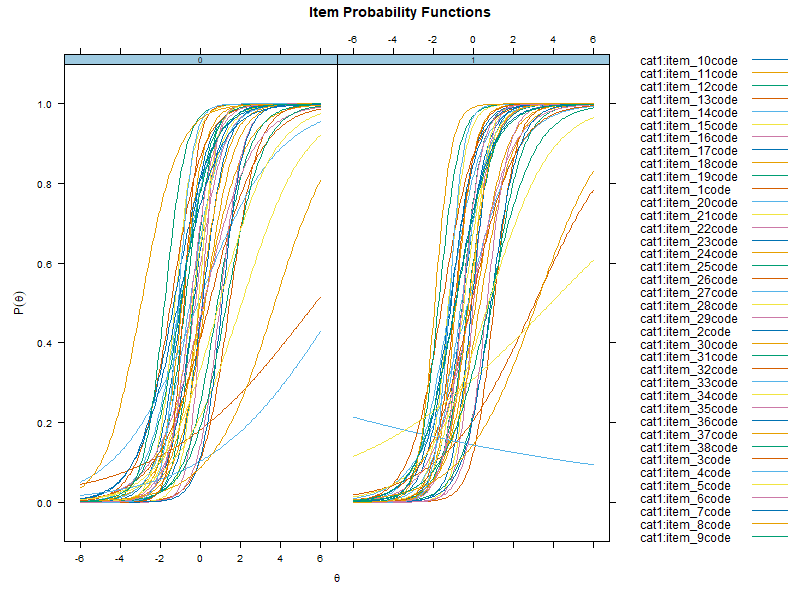

``` {r, echo = FALSE, results = "asis", message = FALSE, warning = FALSE}
library(robustDIF)
#library(mirt)
set.seed(1234)
mirt.dat <- readRDS("../data/mirtdat.rds")
```

# Differential item functioning

In the Item Response Theory (IRT) literature, Differential Item Functioning (DIF) is an approach to assessing situations where response values to an assessment differ as a function of an external covariate; for example, gender or treatment condition. In many contexts, the main goal of DIF analysis is to evaluate whether the items on an assessment are biased in regards to these external covariates. Traditional DIF methods require analysts pre-specify a set of anchor items (items assumed to not have DIF). In the robust DIF method, no such requirement is made. (See technical notes for more details)

The following example demonstrates how to use `robustDIF` to investigate DIF and potential impact across treatment condition on a set of mathematical achievement items.

# Effect of an Adaptive Game-Based Math Learning App on Students' Learning

In a recent block randomized control trial, Bang, Li, and Flynn (2022) investigated whether using My Math Academy, a personalized adaptive learning app, could improve math achievement and learning engagement in K-1 students (n=505 treatment, n=481 control). My Math Academy supplemented school curricula with game-based activities, performance dashboards for teachers, and offline additional learning activities. Between February and June 2019, 41 classrooms from 11 elementary schools participated. Treatment teachers were tasked with using My Math Academy for at least 60 minutes per week. Math achievement was measured using items selected from the Certica assessment item bank at both pre-test and post-test for both conditions. Findings indicated students using My Math Academy had greater math achievement gains than students who did not.

All data were collected from the Item Response Warehouse (https://itemresponsewarehouse.org/).

# Calculating multiple group 2PL model

The following code utilizes `mirt` to build 2PL IRT models for future testing of `robustDIF`:

``` {r eval=FALSE}
# Subset data to just items
items <- mirt.dat[,-39]

# Calculate 1-factor 2PL models, using treatment to split groups and specifying SE=TRUE for the covariance matrix.
mirt <- multipleGroup(items,
                      model = 1,
                      group=mirt.dat$treat,
                      itemtype = "2PL",
                      SE=TRUE)
# Plot the IRFs
plot(mirt.dat, type = "trace", facet = F)
```
``` {r echo = FALSE, message = FALSE, warning = FALSE}
#knitr::include_graphics(here::here("figures", "mirt_plot.png"))
```



A useful first step is to investigate the IRFs of the multiple group 2PL model using `plot()`.

# The Robust DIF procedure

The `get_model_parms()` function from `robustDIF` can now be used to extract the estimates from the `mirt` object. After, robust DIF can be investigated using the `rdif()` function, specifying an `alpha` of .05 and testing for DIF on the slope and intercept with `fun = "d_fun3"`.

```{r message=FALSE, warning=FALSE}
# Save model parameters
parms <- get_model_parms(mirt.dat)

# Investigate DIF
mod <- rdif(mle = parms, fun = "d_fun3", alpha = .05)
# Print estimate
print(mod)
# Print summary
summary(mod)
```

The `print()` function provides the scaling parameter (`0.12`) and standard error (`0.07`) estimated using iteratively reweighted least squares with Tukey's bisquare, and `summary()` provides additional information regarding Wald tests on each of the items. Significant p-values indicate that, at the chosen `alpha`, the item was flagged for DIF. Those items are downweighted to zero during estimation of the scaling parameter. `delta` is the estimated scaling parameter subtracted from the item-level scaling function value.

The items that indicate DIF on both intercepts and slopes are: item 10, item 25, item 27, item 29, item 30, item 31, item 32, item 37, and item 38 - almost a quarter (24%) of test items. This is a nontrivial amount of item-level bias, and can be considered a form of measurement noninvariance. 

# The Rho Function

It is useful to use the `plot()` function to visually inspect the Rho Function for a clear global minimum before proceeding with analyses and making inferences about DIF.

``` {r message = FALSE, warning = FALSE}
# Plot Rho Function
plot(mod)
```

Here, the Rho Function has a clear global minimum.

# Testing for impact

Researchers may wish to know if any DIF present affects conclusions about impact, or how the groups differ on the latent trait. In `robustDIF`, the function `delta_test()` accomplishes this by comparing a naive estimate of impact (here, the unweighted mean of the item-level scaling functions) to the robust estimate above.
``` {r message = FALSE, warning = FALSE}
delta_test(mod)
```
In this output, `delta = naive.est - rdif.est`. The null hypothesis (that both estimators are consistent for the true scaling parameter) is rejected at `p=0.006`. There is evidence that DIF affects conclusions about impact: treatment condition impacts the distribution of the latent trait. Comparisons of total test scores between the two groups may not necessarily be accurate comparisons of mathematical achievement ability.


