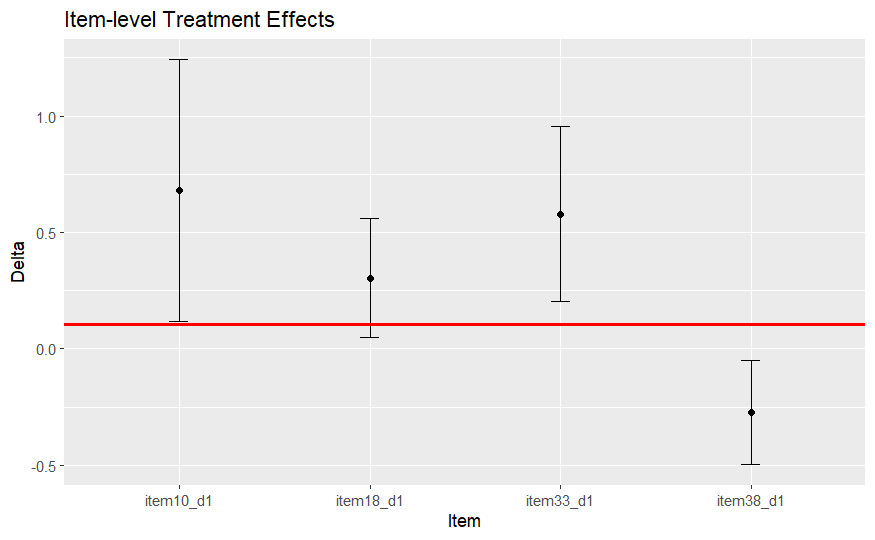

``` {r, echo = FALSE, results = "asis", message = FALSE, warning = FALSE}
library(robustDIF)
#library(mirt)
set.seed(1234)
mirt.dat <- readRDS("../data/mirtdat.rds")
data <- readRDS("../data/irwdat.rds")
```

# Differential item functioning

In the Item Response Theory (IRT) literature, Differential Item Functioning (DIF) is an approach to assessing situations where response values to an assessment differ as a function of an external covariate (for example, gender or treatment condition). In many contexts, the main goal of DIF analysis is to evaluate whether the items on an assessment are biased in regards to these external covariates. In treatment vs control studies, DIF/bias due to treatment condition can be problematic because it can lead to the over-inflation of the treatment effect and limit generalizability to other assessments.

The following example demonstrates how to use `robustDIF` to investigate DIF and potential impact of treatment condition (the treatment effect) on a set of mathematical achievement items.

# Effect of an Adaptive Game-Based Math Learning App on Students' Learning

In a recent block randomized control trial, Bang, Li, and Flynn (2022) investigated whether using My Math Academy, a personalized adaptive learning app, could improve math achievement and learning engagement in K-1 students (n=505 treatment, n=481 control). My Math Academy supplemented school curricula with game-based activities, performance dashboards for teachers, and offline additional learning activities. 

Blocking on school and grade, teachers were cluster randomized to treatment (21 classrooms) or control (20 classrooms). Treatment teachers were tasked with using My Math Academy for at least 60 minutes per week. Control teachers implemented whatever math curricula the district used. The intervention took place between February and June 2019. In total, 41 classrooms from 11 elementary schools participated.

Math achievement was measured at pre-test and post-test using 38 multiple-choice items selected from the Certica assessment item bank. Items were selected if they aligned with Common Core State Standards for K-2 and targeted specific My Math Academy learning objectives. Students had 30-45 minutes to complete the assessment. Responses were coded as 0 (incorrect) or 1 (correct) for the analyses.

Bang and colleagues (2022) estimated a simple treatment effect by computing the difference between mean un-weighted post-test total scores:

$$ TreatmentEffect = \overline{\text{TotalScore}}_{\text{treat}} - \overline{\text{TotalScore}}_{\text{control}}$$ 
$$= 20.97 - 20.08 = 0.89 $$
Dividing by the pooled standard deviation gives a measure of effect size (d):

$$ d = \frac{TE}{sd_p} = \frac{0.89}{8.09} = 0.11 $$


These findings indicate students using My Math Academy had greater math achievement scores than students who did not, but the difference is relatively small. The following analysis will examine whether this effect size is robust to item-level sources of variability that may not generalize to other measures of Math achievement (i.e., tests that have different questions).

# Step 1: Fit IRT model to data

To begin the procedure, we will need to fit an IRT model to the data. All data used in this example is available from the Item Response Warehouse (https://itemresponsewarehouse.org/) and can be downloaded using the following code:

``` {r eval=FALSE}
library(irw) # You may need to first install the package with `devtools::install_github("itemresponsewarehouse/Rpkg")`

# On first use, you will need to log in with a Redivis account (a platform for academic data sharing). See instructions for this on the IRW website.

# Pull the selected data-set
irw.data <- irw_fetch("gilbert_meta_23") 

# Pivot to wide format
wide <- irw_long2resp(irw.data)

# Add cluster ID and treatment ID to wide data
data <- left_join(wide, irw.data[,c(1,2,7)], by="id",multiple="first")
```

The following code utilizes `mirt` to build 2PL IRT models for future testing of `robustDIF`:

``` {r eval=FALSE}
library(mirt) # You may need to install the package first with install.packages("mirt")

# Subset data to just test items
items <- data[,-c(1,40,41)]

# Calculate 1-factor 2PL models, using treatment to split groups and specifying SE=TRUE for the covariance matrix.
mirt.dat <- multipleGroup(items,
                      model = 1,
                      group= as.factor(data$treat),
                      itemtype = "2PL",
                      SE=TRUE)

# Plot the IRFs
plot(mirt.dat, type = "trace", facet = F)
```


A useful first step is to investigate the item response functions (IRFs) of the multiple group 2PL model using `plot()`. Essentially, we are looking for similarities and differences between response functions in the treatment (1) and control (0) groups. If the response functions look near identical, we may not expect to uncover any DIF.

When fitting 2PL IRT models, the latent trait \theta (representing children's underlying "math ability") needs to be scaled (i.e., we restrain it to have a mean of zero and variance of one). This can be problematic when testing differences between groups (tests of DIF), because if we arbitrarily scale \theta in both groups, we give their \theta the same mean and variance. In other words, we end up removing any differences and will show zero impact. The `robustDIF` procedure tackles this problem by instead using robust statistics to estimate scaling parameters and flag items for DIF.

A second issue here is the clustering of observations: students within the same classroom may have similar characteristics (e.g., have similar capabilities, backgrounds, etc.). This leads to partial redundancies in their scores which should be accounted for. The `robustDIF` package can handle this by specifying a `cluster` variable (e.g., classroom id's) in the `get_model_parms()` function.

# Step 2: Is the overall treatment effect robust to item-level variability?

Children using My Math Academy may be exposed to certain types of questions more frequently than those in the control group. For example, My Math Academy includes games that use base-ten blocks for addition and subtraction, whereas some control curricula may not. If the post-test assessment includes base-ten block items, then score differences between groups on those items could reflect differential exposure rather than true differences in underlying math ability.

This issue is known as "construct-irrelevant item-level heterogenous treatment effects" (construct-irrelevant IL-HTE, or construct-irrelevant DIF) and would cast doubt on using total scores, which include base-ten block questions, as a way of demonstrating that the treatment improved math ability.

Additionally, if IL-HTE is present, the generalizability of the treatment effect might be questioned. If the treatment effect is driven by only a subset of test questions, then tests with different questions may not show the same magnitude of effect.

We will turn next to demonstrating how to test for IL-HTE.

The `get_model_parms()` function from `robustDIF` can be used to extract item-level estimates from the `mirt` object. After, robustness to item-level variability can be investigated using the `rdif()` function. Users supply a significance level by setting `alpha` (here, `.05`) and testing for DIF on slope (discrimination), intercept (difficulty), or both with `fun`. 

Here, we choose `d_fun1` to test whether the treatment effect computed using the un-weighted mean of items and scaled to the control group is robust to item-level sources of variation. 

```{r message=FALSE, warning=FALSE}
library(dplyr) # You may need to install the package first using install.packages("dplyr")

# Extract cluster indicator variables (classroom/teacher id)
group_vars <- data$cluster_id

# Save model parameters
parms <- get_model_parms(mirt.dat, cluster=group_vars)

# Investigate DIF
mod <- rdif(mle = parms, fun = "d_fun1", alpha = .05)
# Print estimate
print(mod)
```

The `print()` function provides the robust treatment effect estimate (`0.10`) and standard error (`0.28`) estimated using iteratively reweighted least squares with Tukey's bisquare.

The `delta_test()` function provides both a naive effect estimate (one that aggregates over all test items) and a robust estimate that adjusts for item-level variation.

``` {r message = FALSE, warning = FALSE}
delta_test(mod)
```

The naive effect estimate is `0.24`, `SE = 0.30`. The robust effect estimate that adjusts for item-level variation is `0.10`, `SE = 0.28`. This significant difference (`p < 0.05`) implies that the treatment effect on the total score was driven by only a subset of items with relatively large effects. These items will be investigated next.

# Step 3: Which items show differential treatment effects?

Using `summary` will provide `deltas` (the estimated scaling parameter subtracted from the item-level scaling function value) and `p-values`for each item. Significant `p-values` indicate that, at the chosen `alpha`, the item was flagged for DIF. Those items are down-weighted to zero during estimation of the scaling parameter. 

``` {r}
# Print summary
summary(mod)
```

The direction and magnitude of the significant item-level effects reveal which items were increasing or decreasing the treatment effect. We can subset to significant (`p-value < alpha`) items and plot their effects and 95% CI's in relation to the robust estimate to visualize this.

``` {r eval=FALSE}
# Subset to significant items (set your own p-value if different from 0.05)
sig.items <- mod[["dif.test"]][mod[["dif.test"]]$p.val < 0.05, ]

# Save robust estimate
rob.est <- mod[["est"]]

# Plot
library(ggplot2) # You may need to install the package first with install.packages("ggplot2")

p <- ggplot(data = sig.items, aes(x = row.names(sig.items), y = delta)) +
  geom_point() +
  geom_errorbar(aes(ymin = delta - 1.96*se, ymax = delta + 1.96*se), width=0.1) +
  geom_hline(yintercept=rob.est, col="red", lwd=1) +
  labs(x = "Item", y = "Delta", title = "Item-level Treatment Effects")
p

```



Items whose 95% CIs do not cross the red line had item-level effects significantly larger or smaller than the robust treatment effect estimate (and were downweighted to zero during estimation). These items were:
- Question 10 ("A group of circles is shown. Which of these groups represents the same number of circles?")
- Question 33 (Using base-ten blocks: "What is 355 - 262?")
- Question 38 ("98 - 36 = ")

Items 10 and 33 had positive item-level effect deltas, biasing the treatment effect upward. Only item 38 had a negative item-level effect delta, biasing the treatment effect down. These results indicate that the upward bias of the naive treatment effect was being driven by only two items. If students using My Math Academy had more exposure to these two question types (using circles and base-ten blocks), then the construct validity of the naive treatment effect using total scores would be threatened. In other words, the total scores may not accurately capture math ability. Additionally, the naive effect may be smaller in studies using tests without these two items.

# Step 4: Sensitivity analysis

Before proceeding with the analysis and making inferences about DIF/IL-HTE, use `plot()` to visually inspect the Rho Function for a clear global minimum.

``` {r message = FALSE, warning = FALSE}
# Plot Rho Function
plot(mod)
```

Here, the Rho Function has a clear global minimum, indicating there is a single solution for the scaling parameter. If the Rho function showed multiple local minima of similar values, there would potentially be multiple solutions, and the results would be sensitive to which minima was used during calculations.

# Step 5: Conclusion

In the absence of IL-HTE, the treatment effect based on the total test score and the treatment effect on underlying math ability is equivalent. When IL-HTE is present, as in this example, we can conclude the two are not equivalent: comparing mean total scores between groups is not an adequate representation of differences in underlying math ability. 


