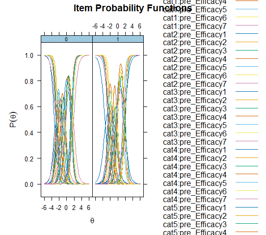

``` {r, echo = FALSE, results = "asis", message = FALSE, warning = FALSE}
library(robustDIF)
#library(mirt)
set.seed(1234)
eg_pits <- readRDS("../data/eg_pits.rds")
```
# Differential item functioning

In the Item Response Theory (IRT) literature, Differential Item Functioning (DIF) is an approach to assessing situations where response values to an assessment differ as a function of an external covariate; for example, gender or treatment condition. In many contexts, the main goal of DIF analysis is to evaluate whether the items on an assessment are biased in regards to these external covariates. Traditional DIF methods require analysts pre-specify a set of anchor items (items assumed to not have DIF). In the robust DIF method, no such requirement is made. (See technical notes for more details)

The following example demonstrates how to use `robustDIF` to investigate DIF across gender in a 5-point Likert-type survey.

# Persistence in the Sciences Survey

# Calculating multiple group Graded Response Model

The following code utilizes `mirt` to build graded response IRT models for future testing of `robustDIF`:

``` {r eval=F}
# Subset data to just items
items <- eg_pits[,c(6:12)]

# Calculate 1-factor 2PL models, using treatment to split groups and specifying SE=TRUE for the covariance matrix.
mirt <- multipleGroup(items,
                      model = 1,
                      group=eg_pits$gender,
                      itemtype = "graded",
                      SE=TRUE)
# Plot the IRFs
plot(mirt, type = "trace", facet = F)
```



A useful first step is to investigate the IRFs of the multiple group GRM using `plot()`.

# The Robust DIF procedure

The `get_model_parms()` function from `robustDIF` can now be used to extract the estimates from the `mirt` object. After, robust DIF can be investigated using the `rdif()` function. Users supply a significance level by setting `alpha` (here, `.05`) and testing for DIF on slope (discrimination), intercept (difficulty), or both with `fun`. Here, we choose `d_fun1` to test for DIF on intercept.

``` {r message=FALSE, warning=FALSE}
# Save model parameters
parms <- get_model_parms(mirt)

# Investigate DIF on item intercepts
mod <- rdif(mle = parms, fun = "d_fun1", alpha = .05)
# Print estimate
print(mod)
# Print summary
summary(mod)
```

The `print()` function provides the scaling parameter (`-0.15`) and standard error (`0.08`) estimated using iteratively reweighted least squares with Tukey's bisquare, and `summary()` provides additional information regarding Wald tests on each of the items. Significant p-values indicate that, at the chosen `alpha`, the item was flagged for DIF. Those items are downweighted to zero during estimation of the scaling parameter. `delta` is the estimated scaling parameter subtracted from the item-level scaling function value.

In the GRM, each item has multiple intercepts - one for each possible response value (holding the first as reference). These intercepts indicate the level of the latent trait where each person is equally likely to respond to values below that response and above. Essentially: what level of the trait is needed to endorse that response or higher.

Tests of intercept DIF on GRM thresholds are tests whether, at the same level of the latent trait, one group consistently endorses higher or lower categories.


# The Rho Function

It is useful to use the `plot()` function to visually inspect the Rho Function for a clear global minimum before proceeding with analyses and making inferences about DIF.

``` {r message=FALSE, warning=FALSE}
# Plot Rho Function
plot(mod2)
```

Here, there is a clear global minimum.
