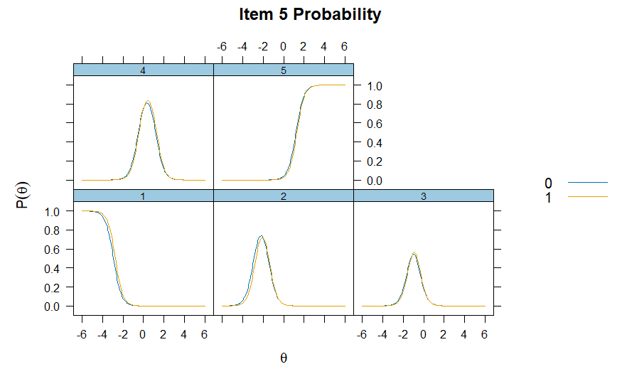
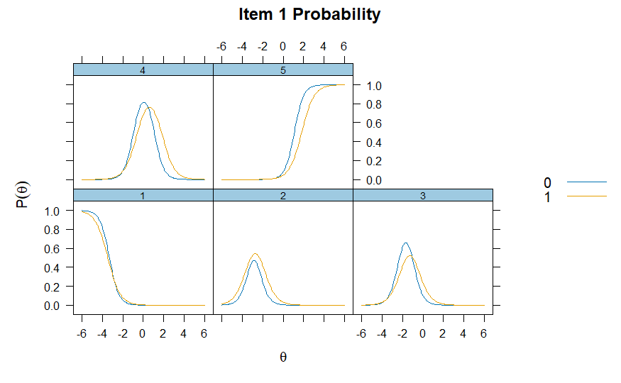

``` {r, echo = FALSE, results = "asis", message = FALSE, warning = FALSE}
library(robustDIF)
#library(mirt)
set.seed(1234)
mirt <- readRDS("../data/pitsmirt.rds")
```
# Differential item functioning

In the Item Response Theory (IRT) literature, Differential Item Functioning (DIF) is an approach to assessing situations where response values to an assessment differ as a function of an external covariate; for example, gender or treatment condition. In many contexts, the main goal of DIF analysis is to evaluate whether the items on an assessment are biased in regards to these external covariates. Traditional DIF methods require analysts pre-specify a set of anchor items (items assumed to not have DIF). In the robust DIF method, no such requirement is made. (See technical notes for more details)

The following example demonstrates how to use `robustDIF` to investigate DIF across gender in a 5-point Likert-type survey.

# Persistence in the Sciences Survey

The Persistence in the Sciences Survey is a validated self-report instrument which measures several social and psychological factors related to undergraduate students' persistence in attaining STEM degrees (Hanauer et al., 2016). The data used for this example consists of 1024 student responses to the Science Self-Efficacy portion of the survey. These include seven items that ask students how confident they are in performing scientific duties (e.g., "Please indicate the extent to which you agree or disagree about your confidence in the following areas: I am confident that I can use technical science skills.") 
Response categories are 1 = "Strongly Disagree", 2 = "Disagree", 3 = "Neither Agree nor Disagree", 4 = "Agree" and 5 = "Strongly Agree."
Administrative data also included self-reported sex, 0 = "Male" and 1 = "Female."

# Calculating multiple group Graded Response Model

The following code utilizes `mirt` to build graded response IRT models for future testing of `robustDIF`:

``` {r eval=F}
# Subset data to just items
items <- eg_pits[,c(6:12)]

# Calculate 1-factor 2PL models, using treatment to split groups and specifying SE=TRUE for the covariance matrix.
mirt <- multipleGroup(items,
                      model = 1,
                      group=eg_pits$gender,
                      itemtype = "graded",
                      SE=TRUE)
# Plot the IRFs
itemplot(mirt, item = 1, type = "trace")
itemplot(mirt, item = 5, type = "trace")
```
Because each item in a GRM has multiple curves, we use `itemplot()` of `type="trace"` for each `item` to investigate the category response functions (CRF). The CRF show how the probability of endorsing each response category changes as a function of the latent trait.



Investigating Item 5, we can see that individuals lower on the latent trait (self-efficacy) are more likely to respond with lower categories ("Disagree" and "Slightly Disagree"), with the probability of endorsing higher categories ("Agree" and "Strongly Agree") increasing as self-efficacy increases. Notably, we can also see the CRFs are very similar between the two groups. (`0` = Male, `1` = Female)


However, investigating Item 1, we notice the two groups start to differ on their CRFs. This may indicate potential DIF, or bias, on this item, relevant to gender.

# The Robust DIF procedure

The `get_model_parms()` function from `robustDIF` can now be used to extract the estimates from the `mirt` object. After, robust DIF can be investigated using the `rdif()` function. Users supply a significance level by setting `alpha` (here, `.01`) and testing for DIF on slope (discrimination), intercept (difficulty), or both with `fun`. Here, we choose `d_fun1` to test for DIF on intercept/difficulty. 

In the GRM, the each item has multiple difficulties, which each represent the points where adjacent categories intersect in the CRF (also called the `category thresholds`). These thresholds represent the level of the latent trait where a respondent is equally likely to respond with values below and above that level. Essentially: the level of the latent trait where respondents transition from a lower category response to a higher one. 

Tests of intercept DIF on GRM thresholds are tests whether, at the same level of the latent trait, one group consistently endorses higher or lower categories.

``` {r message=FALSE, warning=FALSE}
# Save model parameters
parms <- get_model_parms(mirt)

# Investigate DIF on item intercepts
mod <- rdif(mle = parms, fun = "d_fun1", alpha = .01)
# Print estimate
print(mod)
# Print summary
options(scipen=999)
summary(mod)
```

The `print()` function provides the scaling parameter (`-0.15`) and standard error (`0.08`) estimated using iteratively reweighted least squares with Tukey's bisquare, and `summary()` provides additional information regarding Wald tests on each of the items. Significant p-values indicate that, at the chosen `alpha`, the item was flagged for DIF. Those items are downweighted to zero during estimation of the scaling parameter. `delta` is the estimated scaling parameter subtracted from the item-level scaling function value.

Here, the items that were flagged for DIF were: Item 1 (`d2` and `d3`), Item 4 (`d4`), Item 6 (`d4`), Item 7 (`d3`). 


# The Rho Function

It is useful to use the `plot()` function to visually inspect the Rho Function for a clear global minimum before proceeding with analyses and making inferences about DIF.

``` {r message=FALSE, warning=FALSE}
# Plot Rho Function
plot(mod)
```

Here, there is a clear global minimum.
